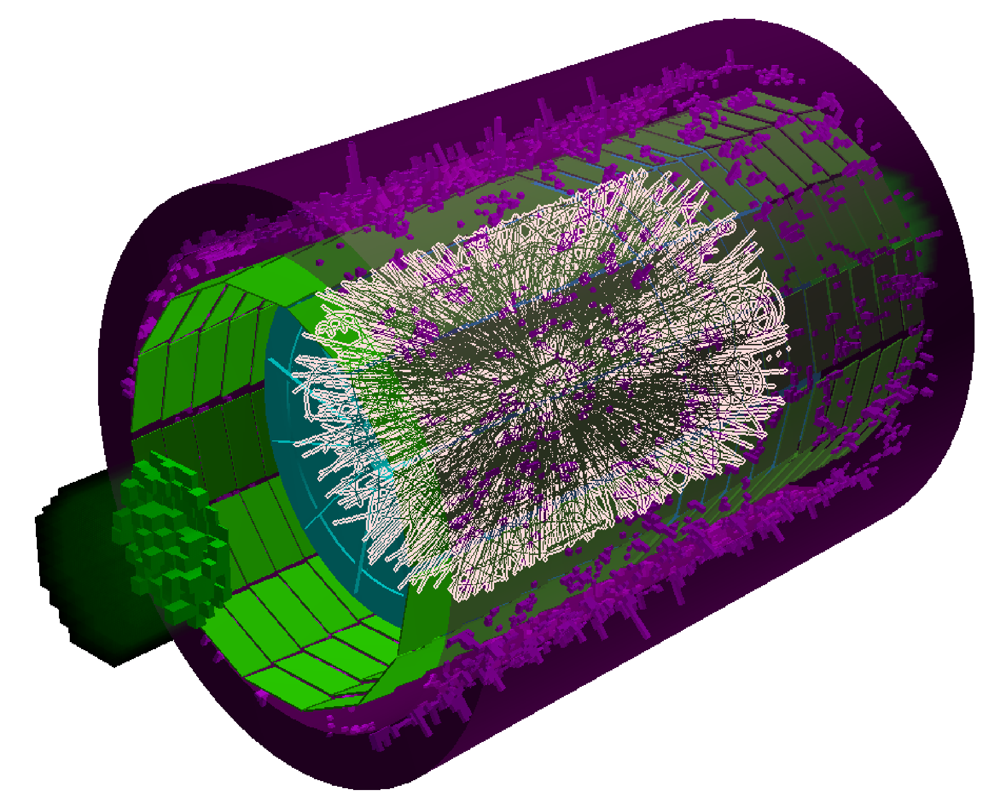

# <b>The MpdRoot Framework </b>
The main framework for the MPD experiment at NICA.  
http://mpdroot.jinr.ru/  



Based on:  
[FairSoft](https://github.com/FairRootGroup/FairSoft) 
and 
[FairRoot](https://github.com/FairRootGroup/FairRoot)

[Getting started](http://mpdroot.jinr.ru/mpdroot-start-guide/)

### Install Prerequisites 
Look for your OS in the link below to install required dependencies  
[Dependencies link](https://github.com/FairRootGroup/FairSoft/blob/master/legacy/dependencies.md)

Additional MPDroot dependencies:  
- fftw3-devel, eigen3-devel, gtest-dev packages for RedHat based OS or fftw3-dev, libeigen3-dev, libgtest-devel for Debian based OS  
- clang-format version 13.0.0 (this version only) is required to run formatting checks if you are a developer:   
if version 13.0.0 is unavailable for your linux distro, then install pipx package available for both Red Hat and Debian based OS.  
(Note: some Debian based OS have lousy pipx support, so you must install additionally python3.8-venv, then run  
 'pipx ensurepath && pipx install clang-format==13.0.0')  

### Automatic Installation

We advise (if you are new user, we strongly suggest) to install FairSoft/FairRoot/MpdRoot by copying the [scripts/install_fair_mpdroot.sh](https://git.jinr.ru/nica/mpdroot/-/raw/dev/scripts/install_fair_mpdroot.sh?inline=false) to your $HOMEDIR
and run:  
```
chmod +x install_fair_mpdroot.sh && ./install_fair_mpdroot.sh
```
or if you are a developer then
```
chmod +x install_fair_mpdroot.sh && ./install_fair_mpdroot.sh -u developer
```
  

This script will perform automatic installation of FairSoft vApr21, FairRoot v18.6.4 and mpdroot. The default parameters are (flags to switch are in quotation marks):  
- regular user: change with '-u developer'
- fair suite installation directory ~/fairSuite: change with '-f path_to_dir'
- mpdroot installation directory ~/mpd: change with '-m path_to_dir'
- don't skip fair suite installation: change with '-s yes' 
- working directory for fair suite build ~/fair_build: change with '-w path_to_dir'
- mpdroot cloned repository directory ~/mpdroot: change with '-r path_to_dir'
- 8 cpu threads used during compilation: change with '-j number_of_threads'

If the script fails, please email the output to hnatics@jinr.ru   

The above installation procedure was tested to work with the following OS (as of December 5th 2021):  
CentOS 7, Fedora 34, Fedora 35, Ubuntu 20.04, Linux Mint 20.2, Pop!_OS 21.04  

#### NOTE: When using MPDRoot SetEnv.sh and config.sh must be invoked in each new terminal by
```
source ~/mpdroot/SetEnv.sh && source ~/mpdroot/build/config.sh
```
alternatively, you can  add this line to your ~/.bashrc file, if you don't want to type this each time you open a new terminal


## Manual Install
For advanced users only, click on the following link:  
[Explanation of automatic installation procedure in steps](https://git.jinr.ru/nica/mpdroot/-/wikis/Manual-Installation-of-Fair-Suite-and-MPDroot)
  
