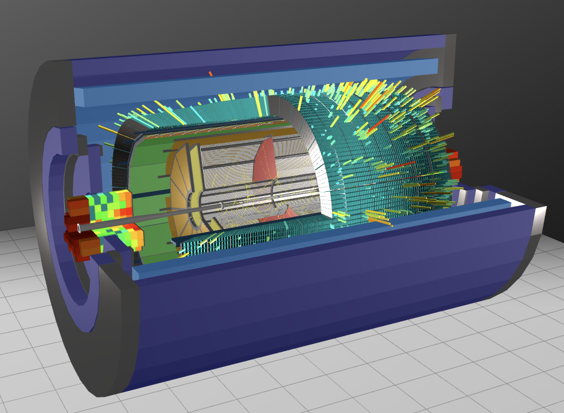

# <b>The MpdRoot Framework </b>
The main framework for the MPD experiment at NICA.  
http://mpdroot.jinr.ru/  

Based on:  
[FairSoft](https://github.com/FairRootGroup/FairSoft) 
and 
[FairRoot](https://github.com/FairRootGroup/FairRoot)

[Getting started](http://mpdroot.jinr.ru/mpdroot-start-guide/)

## Installation and Use

1. <a href="http://mpdroot.jinr.ru/running-mpdroot-on-the-cluster-nica-lhep-hybrilit/" target="_blank">On the cluster</a> 

2. <a href="http://mpdroot.jinr.ru/running-mpdroot-on-local-machine-using-cvmfs/" target="_blank">Locally using CVMFS</a> (recommended)

3. <a href="http://mpdroot.jinr.ru/running-mpdroot-locally-using-alibuild/" target="_blank">Locally using aliBuild</a> (full local build)

4. <a href="http://mpdroot.jinr.ru/how-to-install-mpdroot-legacy-method/" target="_blank">Legacy installation method</a> (obsolete)  
   Explanation of legacy procedure in steps [here](https://git.jinr.ru/nica/mpdroot/-/wikis/Manual-Installation-of-Fair-Suite-and-MPDroot)
